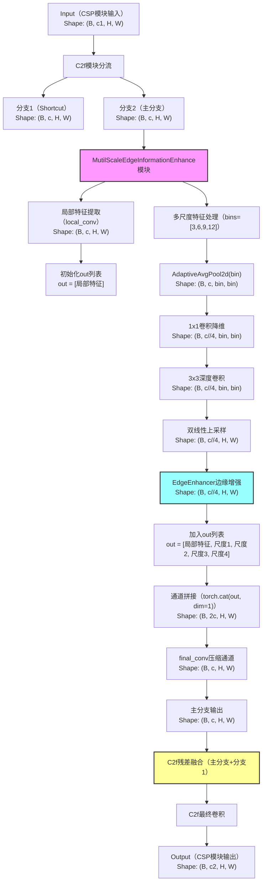

# 一、架构
transformer
深度学习（计算机视觉）
python，数学点到为止
结合具体任务场景，数据挖掘了解，
dino视觉大模型
IoU-aware query selection	交互比感知查询选择
cnn
注意力机制
backbone结构,常见resnet
rtdetr零基础怎么配置，训练。
底层逻辑，知识体系结构，与其他知识点关系
与yolo比较

detr-r18网络配置

初始化

​	nc

​	scale

backbone（骨干网络）：特征提取

由CNN组成，包括RESNet、VGGNet等

neck（颈部）：特征融合，上下文增强

包括FPN、ASPP、SAM等等

head（头检测）

详情：https://blog.csdn.net/m0_48086806/article/details/132155312?ops_request_misc=%257B%2522request%255Fid%2522%253A%2522a57843703d32ab5b9484750686f96f29%2522%252C%2522scm%2522%253A%252220140713.130102334..%2522%257D&request_id=a57843703d32ab5b9484750686f96f29&biz_id=0&utm_medium=distribute.pc_search_result.none-task-blog-2~all~top_positive~default-1-132155312-null-null.142^v102^control&utm_term=DETR&spm=1018.2226.3001.4187

RT-DETR（Real-Time Detection Transformer）是字节跳动提出的**实时目标检测模型**，融合了CNN的高效特征提取能力与Transformer的全局关系建模能力，实现了“精度-速度”的平衡。其完整结构可拆解为以下四个核心模块，各模块分工明确且协同紧密：


### 1. Backbone（骨干网络）
**功能**：从输入图像中提取**多尺度层级特征**（从低阶纹理到高阶语义）。
**结构**：
- 基于经典CNN架构（如ResNet、CSPResNet）的变体，例如RT-DETR-R18、RT-DETR-R50等，由多个“残差块/瓶颈块”堆叠而成。
- 输出多尺度特征图（如`C2`、`C3`、`C4`、`C5`），分别对应“下采样2ⁿ倍”的特征（n=2,3,4,5），覆盖从小目标细节到大体语义的信息。


### 2. Neck（特征融合网络）
**功能**：融合Backbone输出的多尺度特征，解决“小目标因特征层级高而信息丢失”的问题。
**结构**：

- 主流采用 **FPN（特征金字塔网络）** 或 **PAN（路径聚合网络）** 结构，通过“自顶向下（高层语义下传）+ 自底向上（低层细节上传）”的路径，让小目标、大目标的特征在同一层级中得到充分融合。
- 输出**融合后的多尺度特征图**（如P2、P3、P4、P5），为后续Transformer Decoder提供“多尺度+强语义+细细节”的特征输入。

在目标检测（比如你用的 RT-DETR、YOLO）中，**Neck（特征融合层）就是模型的“信息整合中枢”** ——一边接收骨干网络（Backbone，比如 ResNet、CSPDarknet）提取的不同层级图像特征，一边把这些特征“打乱重组、优势互补”，最后输出更全面、更有用的特征给检测头（Head），帮检测头更轻松地识别各种目标。

用人话拆核心作用，结合你的目标检测场景（比如医学影像检测肿瘤、工业质检检测缺陷）：

####  1. 解决“看近”和“看远”的矛盾——融合不同尺度特征
骨干网络提取的特征分“浅层”和“深层”，各自有短板：
- 浅层特征（比如网络前几层输出）：像“放大镜”，能看清目标的细节（比如肿瘤的边缘、缺陷的纹理），但“视野窄”，抓不到全局信息，容易分不清“是目标还是背景”；
- 深层特征（比如网络后几层输出）：像“望远镜”，能看清目标的整体轮廓和上下文（比如肿瘤在影像中的位置、缺陷属于哪个部件），但“细节模糊”，容易漏检小目标（比如微小钙化点、细小组件缺陷）。

Neck 的核心工作就是把这两种特征融合：
- 给深层特征“补细节”：让模型在识别大目标（比如大肿瘤）时，框能画得更准（避免框偏、框大了）；
- 给浅层特征“补全局”：让模型在识别小目标（比如微小结节）时，能精准定位（避免漏检、误判成噪声）。

举个具体例子：
- 骨干网络提取到“浅层特征（能看清钙化点的小点）”和“深层特征（知道这是肺部区域，大概率有病灶）”；
- Neck 把两者融合后，输出的特征既知道“这是肺部（全局）”，又能看清“哪个小点是钙化点（细节）”；
- 检测头拿到这种“全能特征”，就不会漏检小钙化点，也不会把背景的噪点误判成目标。

#### 2. 增强特征的“表达能力”——让模型更懂目标
骨干网络输出的单个层级特征，信息比较“单一”（比如只懂“边缘”“纹理”“轮廓”中的一种）。Neck 通过各种融合操作（比如 RT-DETR 用的 Cross-Scale Fusion、YOLO 用的 FPN+PAN），把不同特征的“优点”捏在一起：
- 比如把“边缘特征”和“纹理特征”融合，模型能更清晰地判断“这个区域是不是目标的边界”；
- 把“局部特征”和“全局特征”融合，模型能更准确地分类“这个目标是肿瘤还是结节”。

简单说：Neck 让特征从“只会说一句话”变成“会说一段完整的话”，检测头接收后，不用再“猜”，直接就能精准输出类别和框。

#### 3. 为检测头“减负”——让后续计算更高效
如果没有 Neck，检测头只能直接用骨干网络的原始特征：
- 要么用浅层特征，漏检小目标、误检多；
- 要么用深层特征，框不准、小目标看不到；
- 要是让检测头自己处理多个层级的特征，计算量会暴增（GFLOPS 飙升），还容易出错。

Neck 提前把特征整合好，输出“统一规格、信息全面”的特征图给检测头，相当于给检测头“喂到嘴边的熟饭”——检测头不用再做复杂的特征处理，只需要专注于“判断是不是目标”“框在哪里”，既提升了检测精度，又降低了模型的计算开销。

#### 4.贴合你的模型（RT-DETR/YOLO）补充：
- RT-DETR 的 Neck 是“混合编码器+跨尺度融合模块”：一边融合骨干网络的多尺度特征，一边和 Transformer 编码器配合，让特征既保留空间信息（框的位置），又有全局关联（目标之间的关系），最后输出的特征直接适配检测头的查询机制，不用额外做特征转换；
- YOLO 系列的 Neck 常用 FPN（自顶向下，深层特征传浅层）+ PAN（自底向上，浅层特征传深层）：双向融合后，特征的多尺度适应性更强，比如 YOLOv8 的 C2f 融合模块，能在轻量化的同时保证特征的丰富度。

#### 5.简单总结：
Neck 的作用就是“整合资源、补齐短板”——把骨干网络零散的、有缺陷的特征，变成全面的、优质的“全能特征”，让检测头能轻松搞定“大目标、小目标、准分类、准框位”，最终提升模型的 mAP（尤其是 mAP@50:95，因为多尺度特征对不同 IoU 阈值的适配性更好）。

如果后续要改进 Neck（论文创新点方向），核心思路就是“让融合更高效、更精准”：比如优化跨尺度融合的方式（减少信息损失）、增加注意力机制（让模型重点关注目标区域的特征）、轻量化融合模块（降低 GFLOPS 和显存占用），这些都能直接提升模型性能或工程实用性~


### 3. Transformer Decoder（Transformer解码器）
**功能**：通过**全局注意力机制**建模“特征-目标-查询”的依赖关系，直接预测目标的类别与边界框（替代传统“锚框”机制）。
**结构与流程**：
- 由**多个Decoder层**组成，每个层包含「自注意力（Self-Attention）」、「交叉注意力（Cross-Attention）」、「前馈网络（Feed-Forward Network）」三大组件。
- **输入**：Neck输出的多尺度特征图 + 预定义的**“目标查询（Object Queries）”**（可理解为“待检测目标的占位符”，数量固定，如300个）。
- **核心操作**：
  - 「交叉注意力」：让“目标查询”与“多尺度特征图”交互，捕捉“特征-查询”的全局关联；
  - 「自注意力」：让“目标查询”之间交互，建模“目标-目标”的上下文关系（如避免重复检测）；
  - 「前馈网络」：对查询特征进行非线性变换，增强表达能力。
- **实时优化**：RT-DETR通过**限制查询数量**（如仅用300个查询，远少于DETR的1000个）、**简化注意力计算**（如采用轻量化注意力变体），确保推理速度。


### 4. Detection Head（检测头）
**功能**：将Transformer Decoder的输出转换为最终检测结果。
**结构**：
- 分为**分类分支**和**回归分支**：
  - 分类分支：输出每个“目标查询”对应的类别概率（如80类COCO数据集的softmax结果）；
  - 回归分支：输出每个“目标查询”对应的边界框坐标（相对于查询的偏移量，最终映射到原图尺度）。
- **后处理**：因Transformer Decoder的“查询-目标”是“唯一分配”的，通常**无需NMS（非极大值抑制）**；部分版本会保留轻量化NMS以进一步提升精度。

RT - DETR的检测头核心是**带辅助预测头的Transformer解码器结构**，还搭配了可学习查询向量和最终的分类、回归分支，整体围绕端到端目标检测设计，以下从结构、作用和改进价值三方面用人话详细拆解：
#### ①检测头的具体结构
它不是单一模块，而是由查询选择模块、Transformer解码器层、辅助预测头和最终预测头组成的组合结构，具体如下：

- **查询选择模块**：采用IoU感知的查询选择机制，不是简单挑分类分数高的特征，而是优先选和真实框重叠度（IoU）高的特征作为初始查询，避免选到“分类分高但框不准”的无效特征，为后续解码打基础。
-  **多层Transformer解码器**：由多个重复的解码器层构成，每层都包含自注意力、交叉注意力和前馈神经网络。自注意力用来捕捉查询向量之间的关联，交叉注意力负责把编码器输出的图像特征融合到查询中，前馈神经网络则对融合后的特征做非线性变换，一步步优化特征信息。
-  **双重预测头**：一是辅助预测头，在解码器迭代优化过程中同步输出结果，帮助训练时稳定梯度、提升模型学习效果；二是最终预测头，由全连接层构成，包含分类分支（输出目标类别概率）和边界框回归分支（输出目标框的坐标、宽高信息）。

#### ②检测头的核心作用
它相当于RT - DETR模型的“最终决策中心”，承接骨干网络和混合编码器处理后的图像特征，完成从特征到检测结果的关键转化，具体作用有三个：

-  **替代传统后处理**：不用依赖非极大值抑制（NMS）来剔除重复框。因为每个查询向量对应一个唯一目标，经过解码器优化后，预测头直接输出无冗余的检测结果，大幅减少了推理时的计算步骤，提升了检测速度。
-  **精准输出检测结果**：通过IoU感知的查询选择拿到高质量初始查询，再经解码器多次迭代优化，最后由预测头精准输出每个目标的类别和位置。比如在交通场景中，能准确识别出车辆、行人，并画出对应的边界框。
-  **稳定模型训练过程**：辅助预测头在训练时的中间输出，能让模型及时调整参数，避免训练过程中梯度波动过大，帮助模型更快收敛到较好的状态。

#### ③改进检测头的作用
改进检测头是提升RT - DETR模型性能、适配更多场景的关键手段，核心价值体现在以下三方面：

-  **提高检测精度**：比如优化查询选择机制，让选中的查询更贴合真实目标；或者增强解码器的特征融合能力，都能让预测头输出的类别和边界框更精准。像之前解决分类分数和IoU分数不一致的问题，改进后高分类分数的预测框往往也是和真实框重叠度高的框，显著提升mAP等核心指标。
-  **适配不同速度需求**：RT - DETR的检测头支持灵活调整解码器层数，不用重新训练就能适配不同场景。比如减少解码器层数时，检测头运算更快，适合智能监控等对实时性要求高的场景；增加层数时，精度提升，可用于医疗影像检测等对精度要求高的场景。
-  **降低硬件适配门槛**：通过简化预测头的全连接层结构、优化特征融合方式等改进，能减少检测头的计算量（降低GFLOPS）和显存占用。这能让RT - DETR在算力较弱的显卡上也能流畅运行，扩大模型的部署范围，比如适配边缘设备的实时检测需求。


#### ④整体流程总结
输入图像 → Backbone提取多尺度特征（C2-C5） → Neck融合为多尺度特征图（P2-P5） → Transformer Decoder通过注意力机制对“特征+查询”交互 → Detection Head输出“类别+边界框” → 筛选置信度阈值得到最终检测结果。


### 5.额外补充
RT-DETR的核心优势
- **无锚框设计**：通过“目标查询”替代传统“锚框”，避免了锚框超参数调优的成本，且天生支持“无重复检测”。
- **端到端训练**：从输入到输出全程无人工后处理（如NMS），训练时直接优化“分类+回归”的联合损失，流程简洁。
- **实时性保障**：通过轻量化Transformer结构、CNN与Transformer的高效结合，在NVIDIA T4上可实现**30+ FPS**的实时推理（RT-DETR-R18）。

这种结构让RT-DETR在无人机航拍、实时监控、自动驾驶等“高实时性+多尺度目标”场景中表现突出，尤其适合小目标、密集目标的检测任务。

#### 检测头

#### 1.上下采样

对图片做resize（分辨率变化）

2倍上采样：图片大小乘二倍

下采样：通过减少特征图的尺寸（长 × 宽），降低数据量和计算复杂度，同时扩大特征的感受野（即特征能 “看到” 的原始图像区域）。适合检测大目标。举例：卷积操作，conv，s=2；池化（如`nn.MaxPool2d`）；

如果要用某一倍数采样的特征图，在上下采样同一尺度的的backbone层中，取最后一层输出作为输入，输入到neck中


# 二、训练
参数问题dir：/project/RTDETR-main/ultralytics/cfg/default.yaml
权重参数要下载

改了r18.yaml就不要下载权重

> 断点续训

​	上一次训练终止了，可以开启train.py中的resume内容改为runs/train/exp3/weights/last.pt，#last.pt path

长时间运行训练代码，请使用nohup后台运行，

如：setsid nohup python train.py > output.log 2>&1 & 

train（训练集）（刷题）：用于模型的核心训练过程，让模型学习数据中的规律

val（验证集）（模拟考）：训练过程中实时评估模型性能，用于调优超参数（如学习率）和避免过拟合。

test（测试集）（考试）：对训练好的最终模型进行无偏评估，反映模型在真实场景中的泛化能力。

## 参数设置

path：ultralytics/cfg/default.yaml

epoch:100	#300

batchsize:4 #跑不动可设成2

imagesz：640

optimizer：AdamW

amp：false #自动混合精度训练

iro：0.0001 #学习率

weight_decay:0.0001

warmup_epoches:2000#迭代次数

# 三、课题方向
### 1.寻找创新点，视频里有

### 2.问ai：我现在的大方向是目标检测，使用的是rtdetr模型，正在做xxx
### 3.找创新点的思路

寻找小众的工科论文应用方向，比如叶片病虫害。

模型改进：基于哪一个基础模型改，rtetr-x和l是v8库自带的，r18是基础库，其他的比如r50等是改进版，如果想基于基础模型改，要看head里的参数，比如如果要基于r18改，head应该是一样的
r18模型更好跑

# 四、算法优化

- 特征提取环节：改进特征提取网络，也就是backbone层

  > 提升检测准确度

- 颈部网络

  > 提升模型对目标关注度

rt-detr-c2f系列：c是指cspnet，c2f是指在轻量化的前提下，减少计算量和参数量并提升模型学习能力，原理是更换c2f的残差块（bottleneck），比如c2f-FFCM就是把bottleneck换成了ffcm模块       优点是轻量化，精度更高，写作的时候要用语言的艺术来描述改进思路，不能直接写c2f系列的优化。


CSP_MutilScaleEdgeInformationEnhance的说明：

代码在：/home/waas/RTDETR-main/ultralytics/nn/extra_modules/block.py中的enhancer、MutilScaleEdgeInformationEnhance以及CSP_MutilScaleEdgeInformationEnhance类

原理在：/home/waas/RTDETR-main/images/MutilScaleEdgeInformationEnhance.jpg

解释：图像输入进去作为input，用平均池化将特征图缩放成对应尺度


基本逻辑是CSP_MSEIE导入MSEIE中的

### 4.1代码核心定位与整体功能
#### 1. 核心作用
这段代码是 **Ultralytics框架下的“多尺度边缘信息增强/选择模块”**，基于RT-DETR的基础组件（C2f模块）改造，核心目标是：  
通过**提取多尺度特征+增强边缘细节+（可选）双域特征选择**，提升目标特征的“轮廓辨识度”和“多尺度适应性”，尤其优化小目标、低对比度目标的特征表达，为后续检测头提供更精准的特征支撑。

#### 2. 属于RT-DETR的哪部分结构？
RT-DETR的完整结构为：`Backbone（骨干网络）→ Neck（特征融合）→ Transformer Decoder → Detection Head`  
这段代码的核心是 **`CSP_MutilScaleEdgeInformationEnhance/Select`** 两个类，它们继承自RT-DETR中最核心的特征提取/融合模块 **C2f**（CSPNet的改进版，广泛用于RT-DETR的Backbone和Neck），因此属于：  
- 优先用于 **Backbone的中间特征提取层**（如C2f堆叠块中），增强骨干网络输出的多尺度特征质量；  
- 也可用于 **Neck的FPN/PAN融合层**，优化跨尺度特征融合时的边缘细节保留。

简单说：它是RT-DETR中“特征提取/融合模块的增强变体”，替换了原始C2f中的基础块（如Bottleneck），让特征更具“边缘感知能力”。


### 4.2逐个类解析（从基础到复杂）
先明确依赖：代码中`Conv`是Ultralytics的自定义卷积（默认含`BN+激活函数`，除非手动指定）；`C2f`是RT-DETR的核心特征块（负责特征分流、融合、梯度传播）；`DualDomainSelectionMechanism`（双域选择机制）是用户自定义的“通道+空间域特征筛选模块”（代码未贴实现，核心是筛选有效特征、抑制冗余）。

#### 1. 基础边缘增强单元：`EdgeEnhancer`
**功能**：提取单尺度特征的边缘信息（高频信息），并与原始特征残差融合（不破坏原始特征）。  
**实现逻辑**（对应代码注释）：
```python
def forward(self, x):
    edge = self.pool(x)       # 1. 3x3平均池化（步长1、padding1）→ 平滑特征（提取低频信息）
    edge = x - edge           # 2. 原始特征 - 平滑特征 → 高频边缘信息（轮廓、细节）
    edge = self.out_conv(edge)# 3. 1x1卷积（保持通道数）+ Sigmoid → 边缘信息加权（控制边缘贡献度）
    return x + edge           # 4. 原始特征 + 加权边缘 → 边缘增强后的特征（残差融合）
```
**输入输出**：  
- 输入：`(B, in_dim, H, W)`（B=批次，in_dim=通道数，H/W=特征图尺寸）  
- 输出：`(B, in_dim, H, W)`（通道数、尺寸不变，仅增强边缘信息）

#### 2. 多尺度边缘增强主模块：`MutilScaleEdgeInformationEnhance`
**功能**：在多个尺度下提取边缘信息，融合后与原始局部特征拼接，最终输出增强特征（无特征选择，仅融合）。  
**关键设计**：  
- `bins=[3,6,9,12]`：4个目标尺度（通过`AdaptiveAvgPool2d`将输入特征下采样到该尺寸），覆盖“全局→局部”的边缘信息；  
- 通道拆分：每个尺度的特征通道数= `inc//len(bins)`（如inc=256，每个尺度通道数=64），避免多尺度融合后通道爆炸；  
- 深度卷积（`g=inc//len(bins)`）：降低计算量，聚焦每个尺度内部的特征交互。

#### 3. 带选择机制的多尺度边缘增强：`MutilScaleEdgeInformationSelect`
**与上者的区别**：在多尺度特征拼接后，加入`DualDomainSelectionMechanism`（双域选择机制），核心是：  
- 对拼接后的特征做“通道域筛选”（保留有效通道）和“空间域筛选”（保留目标区域），抑制冗余信息，提升特征效率。

#### 4. CSP结构融合模块：`CSP_MutilScaleEdgeInformationEnhance/Select`
**功能**：将上述多尺度边缘增强/选择模块，嵌入到RT-DETR的核心`C2f`模块中，形成“CSP结构+边缘增强”的复合特征块。  
- 继承`C2f`的所有特性（特征分流、shortcut残差连接、多分支融合）；  
- 替换`C2f`中原有的`Bottleneck`块为`MutilScaleEdgeInformationEnhance/Select`，让C2f不仅能融合特征，还能增强边缘细节。


### 4.3数据输入输出全过程（带张量形状示例）
以 **`CSP_MutilScaleEdgeInformationEnhance`** 为例（`Select`仅多一步双域选择，流程一致），假设输入特征图参数：  
- 输入到CSP模块的特征：`x_in = (B=2, c1=512, H=64, W=64)`（RT-DETR Backbone中间层的典型特征）；  
- C2f参数：`c2=512`（输出通道）、`e=0.5`（中间通道系数）→ 中间通道`c = c2 * e = 256`（C2f内部的特征通道数）。

#### 详细流程（从CSP模块输入到输出）：
1. **C2f模块分流**（继承自C2f的forward逻辑）：  
   `x_in (2,512,64,64)` → 拆分为两支：  
   - 分支1（shortcut）：直接保留原始特征，后续用于残差融合；  
   - 分支2（主分支）：输入到`self.m`（`MutilScaleEdgeInformationEnhance`模块），即 `x = (2, 256, 64, 64)`（中间通道c=256）。

2. **`MutilScaleEdgeInformationEnhance`的forward流程**：
   | 步骤  | 操作                                  | 张量形状变化                                                 | 说明                                |
   | ----- | ------------------------------------- | ------------------------------------------------------------ | ----------------------------------- |
   | 2.1   | 局部特征提取                          | `x (2,256,64,64)` → `local_conv(x) → (2,256,64,64)`          | `local_conv`是3x3卷积，保留局部特征 |
   | 2.2   | 初始化输出列表                        | `out = [(2,256,64,64)]`                                      | 先存入局部特征                      |
   | 2.3   | 多尺度特征处理（遍历bins=[3,6,9,12]） |                                                              | 4个尺度并行处理，以bin=3为例：      |
   | 2.3.1 | 下采样到目标尺度                      | `x (2,256,64,64)` → `AdaptiveAvgPool2d(3) → (2,256,3,3)`     |                                     |
   | 2.3.2 | 通道降维                              | `Conv(256→64, 1x1) → (2,64,3,3)`                             | 64=256//4（4个尺度均分通道）        |
   | 2.3.3 | 深度卷积增强                          | `Conv(64→64, 3x3, g=64) → (2,64,3,3)`                        | 深度卷积，降参且聚焦局部交互        |
   | 2.3.4 | 上采样回原尺寸                        | `F.interpolate(...) → (2,64,64,64)`                          | 双线性插值，恢复到输入尺寸          |
   | 2.3.5 | 边缘增强                              | `EdgeEnhancer(...) → (2,64,64,64)`                           | 提取并加权边缘信息                  |
   | 2.3.6 | 加入输出列表                          | `out.append(...)` → `out = [(2,256,64,64), (2,64,64,64), (2,64,64,64), (2,64,64,64), (2,64,64,64)]` | 4个尺度处理完后，列表共5个元素      |
   | 2.4   | 多特征拼接                            | `torch.cat(out, dim=1) → (2, 256+64*4, 64,64) = (2, 512, 64,64)` | 通道维度拼接（256+256=512）         |
   | 2.5   | 最终特征压缩                          | `final_conv(512→256) → (2,256,64,64)`                        | 3x3卷积将通道降回中间通道数c=256    |

3. **C2f模块最终融合**（继承自C2f）：  
   - 主分支输出（2,256,64,64）与分支1（shortcut，2,256,64,64）残差融合；  
   - 经过C2f的最终卷积层，输出 `x_out = (2, 512, 64, 64)`（通道数恢复为c2=512）。

#### 补充：`MutilScaleEdgeInformationSelect`的差异
仅在步骤2.4和2.5之间增加：  
`torch.cat(out, dim=1) → (2,512,64,64) → self.dsm(...) → (2,512,64,64)`（双域选择，通道/尺寸不变）→ 再进入`final_conv`。


### 4.4执行流程图（从Input到Output）
以下是 **`CSP_MutilScaleEdgeInformationEnhance`** 的完整执行图（`Select`仅多“双域选择”节点），用Mermaid语法绘制（可直接复制到支持Mermaid的工具渲染，如Typora、Mermaid Live Editor）：



### 4.5关键总结
1. **核心价值**：通过“多尺度边缘提取+残差融合+CSP结构嵌入”，增强特征的边缘细节和多尺度适应性，帮助RT-DETR更好地捕捉小目标、低对比度目标的轮廓特征。  
2. **结构定位**：RT-DETR的Backbone或Neck中的C2f增强模块，替换原始C2f的基础块，不改变整体网络架构，仅提升特征质量。  
3. **数据守恒**：输入输出的特征图尺寸（H/W）和通道数（c1→c2）完全匹配原始C2f模块，可无缝替换使用。

### 4.6做实验

不要带着解决问题的想法去做实验，而是通过实验发现哪些好的点变成自己的创新点

消融实验，模型对比实验，模块对比试验

数据及分类：训练-测试-验证

消融和对比实验指标：一般是precision，recall，map50，map（95）50

### 4.7优化步骤和策略

更换backbone

更换neck

改进backbone

改进neck

改进检测头

改进损失函数

改进剪枝/蒸馏

# 五、断点续训

上一次训练终止了，可以开启train.py中的resume内容改为runs/train/exp3/weights/last.pt，#last.pt path

长时间运行训练代码，请使用nohup后台运行，

如：setsid nohup python train.py > output.log 2>&1 & 

# 六、代码

r18.yaml
	yaml是配置文件于 Ultralytics YOLO/RT-DETR 框架而言，这份 YAML 文件是 模型结构配置文件
	三个核心：parameters、backbone、head
	执行逻辑：
	1.读取配置参数
	2.构建 Backbone（骨干网络）
	3.构建 Head（检测头）
	4.生成检测结果（目标类别、坐标）
	5.绑定训练 / 推理逻辑

怎么在代码中体现创新：已经提供修改好的代码和每个改进点的配置文件，修改yaml配置文件组合创新点即可

# 七、评估指标

 epoch,train/giou_loss,train/cls_loss,train/l1_loss,metrics/precision(B),metrics/recall(B),metrics/mAP50(B),metrics/mAP50-95(B),val/giou_loss,** val/cls_loss,val/l1_loss,lr/pg0,lr/pg1,lr/pg2

- **GFLOPS/GB**：
  
  GFLOPS（Giga Floating-point Operations Per Second）表示每秒十亿次浮点运算，反映模型的计算复杂度；GB是显存占用量（Gigabyte），体现模型对显卡内存的需求。该指标用于衡量模型的计算和显存开销。 

  GFLOPS 和 GB（显存占用）说人话就是：**衡量模型 “跑起来费不费显卡” 的两个核心指标 —— 一个看 “计算量大小”，一个看 “占显卡内存多少”**，直接关系到你的模型能不能在现有硬件上跑、跑得多快。
  
- **IOU**：

  计算不同图像相互重叠比例的大小，在模型训练完确定了预测框位置后，可以计算输出框和真实框之间的IOU

  IoU 说人话就是：**模型画的 “预测框” 和真实目标的 “标注框”，重叠部分占总覆盖面积的比例**—— 简单说就是 “两个框贴得有多近”，用来判断模型的框准不准。

- **mAP@50/%**：
  
  - 即mean Average Precision at IoU=0.5，是目标检测任务中常用的评价指标。以交并比（IoU）阈值0.5为标准，计算所有类别平均精度的平均值，反映模型在较宽松匹配标准下的检测性能。
  - mAP@50 说人话就是：**所有类别的目标，在 “宽松匹配标准” 下，“又准又全” 的平均水平**—— 是把精确率（准不准）和召回率（全不全）结合起来，再给所有类别算个平均分的综合指标。
  
- **mAP@50:95/%**：
  
  - 即mean Average Precision at IoU from 0.5 to 0.95 with step 0.05，是更严格的评价指标。在IoU阈值从0.5到0.95以0.05为步长的多个阈值下，计算所有类别平均精度的平均值，综合衡量模型在不同匹配严格度下的检测性能。
  - mAP@50:95 说人话就是：**所有类别在 “从宽松到严苛” 的一系列标准下，“又准又全” 的综合平均分 —— 比 mAP@50 更挑模型，能看出模型检测的 “稳定性和精准度”**。
  
- **P/%（Precision）**：
  
  - 精确率，指模型预测为正类的样本中实际为正类的比例，公式为\( P = \frac{TP}{TP + FP} \)（TP为真阳性，FP为假阳性），反映模型预测结果的“精准度”。
  - 精确率（Precision）说人话就是：**模型喊 “找到目标了” 的所有结果里，真正是目标的比例**—— 简单说就是 “没瞎喊” 的程度。
  
- **R/%（Recall）**：
  
  - 召回率，指实际为正类的样本中被模型预测为正类的比例，公式为\( R = \frac{TP}{TP + FN} \)（FN为假阴性），反映模型对正类样本的“覆盖度”。
  - 召回率（Recall）说人话就是：**所有真正该被检测出来的目标，模型实际抓到了多少的比例**。
  
- **p/MB**：
  
  - 模型参数量（parameter）以兆字节（MB）为单位，体现模型的大小，参数量小的模型更易部署在资源受限的设备上。
  
- **FPS/(frame·s⁻¹)**：
  
  - Frames Per Second，即每秒处理的图像帧数，反映模型的推理速度，速度越高越适合实时检测场景。


为了清晰说明`train`、`val`、`test`在实验环节的使用逻辑，我们可以按**实验流程步骤**逐一拆解：


### 步骤1：数据集拆分（实验准备阶段）
将原始数据集按一定比例（如6:2:2或7:1:2）拆分为 **训练集（train）**、**验证集（val）**、**测试集（test）**。
- 训练集：用于模型“学习知识”，是模型参数更新的唯一数据来源。
- 验证集：用于实验过程中“调整策略”，不参与参数更新。
- 测试集：全程“隐藏”，仅在最终评估时使用，保证结果客观性。


### 步骤2：模型训练环节（实验核心阶段）
模型基于**训练集（train）** 迭代训练（如 thousands of epochs）。
- 每次训练迭代后，立即用**验证集（val）** 测试模型性能（如计算mAP、精确率等指标）。
- 通过验证集的性能反馈，调整实验策略：
  - 若“训练集准确率很高，但验证集准确率低”→ 模型**过拟合**，需调整正则化、数据增强等策略；
  - 若“训练集和验证集准确率都很低”→ 模型**欠拟合**，需增加模型复杂度、延长训练时间等。


### 步骤3：模型调优环节（实验迭代阶段）
根据验证集的反馈，反复调整模型结构、超参数（如学习率、batch size）、训练策略等，直到验证集性能达到预期。
- 每一次调整后，都要重新用**训练集**训练模型，并在**验证集**上验证效果，直到找到最优配置。


### 步骤4：最终评估环节（实验收尾阶段）
当模型在验证集上的性能稳定后，用**测试集（test）** 进行**无偏评估**，得到模型在真实场景下的泛化能力（如最终的mAP、FPS等指标）。
- 测试集是“最终考官”，其结果是实验结论的核心依据（因为验证集已参与过策略调整，可能存在“适配性偏差”，而测试集全程未参与任何调整，结果更客观）。


### 一句话总结逻辑
- `train`：**训练模型，更新参数**；
- `val`：**中途“体检”，指导调优**；
- `test`：**最终“高考”，验证泛化**。

可以把这个过程类比为“学生备考”：
- 训练集 = 日常习题（用来反复练习，巩固知识）；
- 验证集 = 模拟试卷（用来检测水平，调整复习策略）；
- 测试集 = 高考真题（用来最终评估，反映真实能力）。

这些是 **目标检测模型（如YOLO、RT-DETR）训练过程中的核心日志指标**，按“训练损失、验证损失、评价指标、学习率”四类划分，每一项都对应模型训练的关键状态，下面逐一详细解释（结合目标检测任务逻辑和工程实现场景）：


### 一、核心分类与指标含义
#### 第一类：训练集损失（`train/xxx_loss`）—— 模型训练的“优化目标”
损失函数（Loss）是模型迭代优化的核心，数值越低表示模型在训练集上的预测结果越接近真实标签，共3类损失共同构成训练总损失：
| 指标名称          | 核心含义                                        | 作用场景                                                     |
| ----------------- | ----------------------------------------------- | ------------------------------------------------------------ |
| `train/giou_loss` | 训练集上的 **GIOU损失（Generalized IOU Loss）** | 用于优化「边界框回归」（预测目标的位置和大小），比传统IOU损失更能解决“无重叠、包含”场景的边界框优化问题，同时考虑边界框的重叠度、中心点距离、尺度差异。 |
| `train/cls_loss`  | 训练集上的 **分类损失（Classification Loss）**  | 用于优化「目标分类」（判断预测的边界框内是哪一类目标，如“人、车、无人机”），通常基于交叉熵损失（CE）或Focal Loss（解决类别不平衡）实现。 |
| `train/l1_loss`   | 训练集上的 **L1损失（L1 Regression Loss）**     | 辅助优化「边界框回归」，计算预测边界框坐标（x1,y1,x2,y2或cx,cy,w,h）与真实标签的绝对误差，让边界框坐标预测更平稳（避免极端值影响）。 |

> 补充：模型训练的总损失 = 权重1×giou_loss + 权重2×cls_loss + 权重3×l1_loss（权重在配置文件中设置，平衡回归和分类的优化优先级）。


#### 第二类：验证集损失（`val/xxx_loss`）—— 模型泛化能力的“试金石”
与训练集损失一一对应，但计算对象是 **验证集**（训练过程中未参与训练的独立数据），核心作用是判断模型是否“过拟合”：
| 指标名称        | 核心含义           | 关键解读                                                     |
| --------------- | ------------------ | ------------------------------------------------------------ |
| `val/giou_loss` | 验证集上的GIOU损失 | 若训练损失持续下降，但验证损失上升 → 模型过拟合（只记住训练数据，泛化差）。 |
| `val/cls_loss`  | 验证集上的分类损失 | 理想状态：训练损失和验证损失同步平稳下降，最终趋于收敛（数值接近且稳定）。 |
| `val/l1_loss`   | 验证集上的L1损失   |                                                              |


#### 第三类：模型性能评价指标（`metrics/xxx(B)`）—— 模型效果的“最终评分”
这类指标是目标检测任务的核心评价标准，直接反映模型的检测能力，括号内的`(B)`通常指“基于预测边界框（Bounding Box）计算”或“按批次（Batch）统计”，不影响核心含义：
| 指标名称               | 核心含义                                                     | 通俗解读（判断标准）                                         |
| ---------------------- | ------------------------------------------------------------ | ------------------------------------------------------------ |
| `metrics/precision(B)` | **精确率（Precision）**：预测为“正例”的结果中，真实为“正例”的比例。 | 精确率越高 → 模型“少误判”（越少把背景/其他类别误判为目标），比如预测100个“车”，90个是真车，精确率=90%。 |
| `metrics/recall(B)`    | **召回率（Recall）**：真实为“正例”的目标中，被模型成功检测到的比例。 | 召回率越高 → 模型“少漏检”（越少错过真实目标），比如场景中有100辆车，模型检测到85辆，召回率=85%。 |
| `metrics/mAP50(B)`     | **平均精度均值（mean Average Precision）**：IOU阈值=0.5时的mAP。 | 目标检测的“核心指标”！衡量模型在所有类别上的综合检测能力（平衡精确率和召回率），数值越高效果越好（如mAP50=0.8表示80%的综合检测精度）。 |
| `metrics/mAP50-95(B)`  | IOU阈值从50到95（每隔5，即50、55、…、95）的平均mAP。         | 比mAP50更严格！衡量模型对“边界框定位精度”的敏感度（阈值越高，要求预测框与真实框重叠度越高），数值越高说明定位越精准。 |

> 补充：小目标检测任务中，`mAP50`更关注“是否检测到目标”，`mAP50-95`更关注“检测框是否精准贴合小目标”。


#### 第四类：学习率（`lr/pg0`、`lr/pg1`、`lr/pg2`）—— 模型训练的“步长”
学习率（Learning Rate）控制模型参数更新的幅度，`pg`是「参数组（Parameter Group）」的缩写，目标检测模型（如YOLO、RT-DETR）通常将网络参数分为3组，分别设置不同学习率（避免部分参数更新过快/过慢）：
| 指标名称 | 核心含义          | 常见参数组划分（以YOLO/RT-DETR为例）                         |
| -------- | ----------------- | ------------------------------------------------------------ |
| `lr/pg0` | 第0组参数的学习率 | 通常是「主干网络（Backbone）」参数（如ResNet、CSPNet），预训练权重初始化后，学习率设置较低（如初始lr的0.1倍），避免破坏预训练特征。 |
| `lr/pg1` | 第1组参数的学习率 | 通常是「颈部特征融合网络（Neck）」参数（如FPN、PANet），学习率为初始lr的1倍（平衡特征融合的更新速度）。 |
| `lr/pg2` | 第2组参数的学习率 | 通常是「检测头（Detection Head）」参数（分类分支、回归分支），学习率为初始lr的10倍（检测头是任务核心，需要更快更新以适配数据集）。 |

> 关键逻辑：训练过程中学习率会按预设策略（如余弦退火、线性衰减）下降，比如`pg0`的学习率始终低于`pg2`，确保主干网络稳定，检测头快速适配任务。


### 二、核心指标解读逻辑（帮你判断训练效果）
1. **损失曲线**：训练/验证的3类损失应“平稳下降→趋于收敛”，若验证损失突然上升 → 过拟合（需加正则化、数据增强）；若损失不下降 → 学习率过低、模型初始化有问题。
2. **评价指标**：`precision`和`recall`需平衡（过高精确率可能导致召回率低，反之亦然），`mAP50`和`mAP50-95`应持续上升，最终稳定在较高水平（如小目标检测mAP50≥0.7）。
3. **学习率**：训练初期学习率较高（快速更新参数），后期逐渐下降（微调参数），若学习率一直不变 → 可能导致模型震荡不收敛。

   这些指标是模型训练的“仪表盘”，通过监控它们能快速定位训练问题，优化模型性能～

### 三、热力图


颜色越深，数据对模型影响最大        

# 八、对比试验

与yolo相比：训练成本更高

对比试验的参数，环境可以不一样

# 九、消融实验

模块内，模块之间，创新点之间的消融参数要一样，如果做模型不同尺寸的消融实验，参数可以不一样

# 十、泛化实验

看期刊要求要不要做这一模块