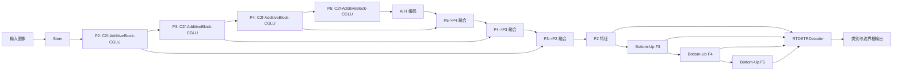
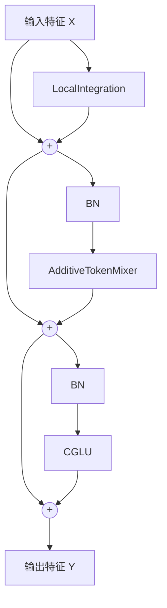

# 面向无人机电力巡检与航拍场景的 RT-DETR 增强型小目标检测算法研究

## 摘要
针对无人机电力巡检与航拍场景中目标尺寸小、分布密集、背景干扰强以及遮挡严重等问题，原始 RT-DETR 在高倍率下采样后易出现细粒度信息丢失和小目标定位不稳的现象。为此，本文提出一种面向小目标检测的增强型 RT-DETR 改进方法。首先，在骨干网络中以 `C2f_AdditiveBlock_CGLU` 替代部分常规特征提取单元，利用局部建模、加性 token 混合和卷积门控线性单元协同增强浅层纹理与中层语义表征。其次，在特征融合阶段引入 `P2` 检测分支，构建四尺度特征金字塔，以缓解微小目标在深层特征中的细节衰减问题。进一步地，结合坐标注意力机制与面向小目标的边界框回归策略，强化空间位置信息建模并提升密集场景下的框回归质量。以 VisDrone2019 作为通用无人机航拍小目标基准数据集进行验证，实验结果表明：相较 RT-DETR-r18 基线，所提方法在较小参数规模下实现了更高的检测精度。其中，`C2f-Add + P2 + CA + InnerIoU` 模型的 mAP50 达到 39.85%，mAP50-95 达到 23.33%；若采用默认损失配置，`C2f-Additive-CGLU + P2 Head` 模型的 mAP50-95 可达到 23.43%。研究结果表明，所提方法在兼顾精度与模型轻量化方面具有较好的工程应用价值，可为无人机巡检和低空航拍目标检测提供参考。

**关键词**：无人机巡检；航拍图像；小目标检测；RT-DETR；多尺度特征融合；坐标注意力

## 0 引言
无人机电力巡检与低空航拍场景通常具有视角高、拍摄范围大、目标尺度跨度大等特点，绝缘子、导线金具、车辆、行人及其他关注目标在图像中往往仅占据少量像素，且常伴随复杂背景、密集分布与局部遮挡。传统卷积检测器虽然具有较高推理效率，但在长距离依赖建模和密集场景全局关联表达方面存在不足；基于 Transformer 的检测方法具有端到端和全局建模优势，但其在小目标场景中仍面临高层特征分辨率不足、定位精细度不够等问题。

现有无人机小目标检测研究大多围绕三个方向展开：一是通过轻量化或增强型骨干网络提升多尺度特征提取能力；二是引入 `P2/P3` 等高分辨率检测层强化微小目标表征；三是通过改进分类与回归损失提升密集场景下的匹配和定位质量。结合仓库中已整理的相关文献与实验笔记可以看出，这类研究通常遵循“场景痛点分析 -> 原始 RT-DETR 不足 -> 结构改进 -> 消融与对比验证”的写作逻辑，篇幅集中、问题导向明确，较适合中文核心期刊常见的工程技术论文表达方式。

基于此，本文围绕 RT-DETR 在小目标场景下的两个核心瓶颈展开改进：一是浅层高分辨率特征利用不足，导致微小目标细节被多次下采样后难以保留；二是密集小目标的边界框定位对传统 IoU 类回归目标较为敏感，存在框偏移与回归不稳定问题。本文的主要工作如下：

1. 构建基于 `C2f_AdditiveBlock_CGLU` 的轻量化特征提取主干，以局部建模和加性 token 混合提升特征表达效率。
2. 设计面向小目标的 `P2` 四尺度检测头，使解码器同时接收 `P2-P5` 多层级特征，增强微小目标可分性。
3. 在增强版本中引入 `CoordAtt` 与 `Inner-IoU/NWD` 回归策略，改善密集场景中的空间注意分配与边界框拟合效果。

## 1 RT-DETR 算法基本原理
RT-DETR 由骨干网络、混合编码器和 Transformer 解码器三部分组成。骨干网络负责提取多尺度卷积特征，混合编码器融合不同层级的语义与空间信息，解码器通过固定数量的查询向量完成类别预测与边界框回归。相较传统 DETR，RT-DETR 通过高效混合编码器与查询机制提升了实时性，适用于无人机场景下兼顾精度与速度的检测任务。

然而，原始 RT-DETR 在小目标航拍场景中仍存在以下不足：

1. 默认输入给解码器的最浅层特征通常从 `P3` 开始，最小下采样倍率为 8，难以保留极小目标的有效纹理。
2. 小目标目标框尺寸有限，轻微的中心偏移和宽高误差都会显著影响 IoU 指标，导致训练过程中的回归监督更不稳定。
3. 在密集分布场景下，仅依赖高层语义信息容易造成浅层定位信息利用不充分，影响小目标召回率。

因此，有必要针对 RT-DETR 的特征提取、特征融合和回归约束三个环节进行协同优化。

## 2 改进模型设计

### 2.1 整体结构
本文改进模型以 RT-DETR-r18 体系为基础，在骨干网络中引入 `C2f_AdditiveBlock_CGLU`，在检测头中增加 `P2` 高分辨率分支，并在增强版本中叠加坐标注意力与小目标回归损失。模型整体结构如图1所示。

**图1** 改进 RT-DETR 小目标检测网络总体结构

### 2.2 C2f-AdditiveBlock-CGLU 轻量化骨干
为提升浅层与中层特征的表达能力，本文在骨干网络多个阶段采用 `C2f_AdditiveBlock_CGLU` 替换传统卷积块。根据代码实现，该模块由局部感知分支、加性 token 混合分支和卷积门控线性单元组成，并以残差方式逐级叠加。其核心计算过程可表示为：

\[
\begin{aligned}
X_1 &= X + \mathcal{L}(X), \\
X_2 &= X_1 + \mathcal{A}(\mathrm{BN}(X_1)), \\
Y &= X_2 + \mathcal{G}(\mathrm{BN}(X_2)),
\end{aligned}
\]

式中，\(X\) 为输入特征，\(\mathcal{L}(\cdot)\) 表示局部感知映射，\(\mathcal{A}(\cdot)\) 表示加性 token 混合，\(\mathcal{G}(\cdot)\) 表示卷积门控线性单元，\(Y\) 为输出特征。

与常规卷积块相比，该结构兼顾了局部纹理捕获与跨位置特征交互，能够在不显著增加参数量的前提下增强小目标纹理细节表达。其模块逻辑如图2所示。

**图2** `AdditiveBlock-CGLU` 模块结构示意图

### 2.3 引入 P2 检测头的多尺度特征融合
原始 RT-DETR 通常使用 `P3-P5` 三尺度特征作为解码器输入，而 VisDrone 等航拍场景中的小目标在高层特征图上仅对应极少数像素。为此，本文引入步长为 4 的 `P2` 特征层，并在特征融合部分构建自顶向下与自底向上的双向路径，使解码器接收 `P2、P3、P4、P5` 四个尺度的融合特征。

对于输入图像尺寸为 \(H \times W\) 的情形，各层特征图尺度可记为：

\[
P_2 \in \mathbb{R}^{\frac{H}{4}\times\frac{W}{4}},\quad
P_3 \in \mathbb{R}^{\frac{H}{8}\times\frac{W}{8}},\quad
P_4 \in \mathbb{R}^{\frac{H}{16}\times\frac{W}{16}},\quad
P_5 \in \mathbb{R}^{\frac{H}{32}\times\frac{W}{32}}.
\]

在此基础上，多尺度融合可抽象表示为：

\[
F_l = \phi\left(\mathrm{Concat}\left(U(F_{l+1}), P_l\right)\right), \quad l \in \{2,3,4\},
\]

式中，\(U(\cdot)\) 表示上采样算子，\(\phi(\cdot)\) 表示卷积融合单元。通过引入 `P2`，模型能够保留更多高分辨率边缘和纹理信息，从而提升对微小目标的识别与定位能力。

### 2.4 CoordAtt 与小目标回归损失
在增强版本中，本文进一步在 `C2f_AdditiveBlock_CGLU_CoordAtt` 中引入坐标注意力机制。其思想是分别沿高度和宽度方向编码位置信息，再对通道响应进行重标定。设输入特征为 \(X \in \mathbb{R}^{C\times H\times W}\)，则高度方向和宽度方向的聚合可表示为：

\[
z_c^h(h)=\frac{1}{W}\sum_{i=1}^{W}x_c(h,i), \qquad
z_c^w(w)=\frac{1}{H}\sum_{j=1}^{H}x_c(j,w).
\]

经共享变换和分支卷积后，得到两个方向的权重 \(a_h\) 与 \(a_w\)，最终输出为：

\[
Y = X \odot a_h \odot a_w,
\]

式中，\(\odot\) 表示逐元素相乘。该机制有助于在复杂背景中突出与目标位置相关的特征区域。

针对小目标框回归易受中心偏移影响的问题，本文还采用 `Inner-IoU` 与 `NWD` 组合的回归约束。其回归损失可写为：

\[
L_{reg} = \eta \left(1-\mathrm{InnerIoU}\right) + (1-\eta)\left(1-\mathrm{NWD}\right),
\]

其中，\(\eta\) 为权重系数。`NWD` 的形式为：

\[
\mathrm{NWD}(b_p,b_g)=\exp\left(-\frac{\sqrt{d_c^2+d_s^2}}{C}\right),
\]

式中，\(b_p\) 与 \(b_g\) 分别表示预测框与真实框，\(d_c\) 表示中心点距离项，\(d_s\) 表示宽高差异项，\(C\) 为归一化常数。该设计能够在 IoU 变化剧烈的小目标场景下提供更平滑的回归监督。

对于分类分支，本文尝试采用基于 IoU 质量分数的变体损失，其基础权重形式可表示为：

\[
L_{cls}=\mathrm{BCE}(p,q)\left[\alpha p^\gamma(1-y)+qy\right],
\]

式中，\(p\) 为预测得分，\(q\) 为质量感知标签，\(y\) 为 one-hot 类别标记，\(\alpha\) 与 \(\gamma\) 为调节参数。

## 3 实验与结果分析

### 3.1 数据集与实验设置
本文选取 VisDrone2019 作为通用无人机航拍小目标检测基准。该数据集包含行人、车辆、非机动车等多类典型航拍目标，具有目标尺寸小、密度高、背景复杂等特点，与无人机电力巡检和低空航拍任务中的目标检测需求具有较高相似性。实验基于 Ultralytics 改进框架实现，输入尺寸设为 `640×640`，优化器采用 `AdamW`，主要评价指标包括 Precision、Recall、mAP50、mAP50-95、参数量、GFLOPs 及端到端推理速度。

### 3.2 对比结果
根据仓库中的实验记录与 `paper_data.txt`，选取具有代表性的模型进行对比如表1所示。

| 模型 | Params/M | GFLOPs | FPS(E2E) | mAP50/% | mAP50-95/% |
| --- | ---: | ---: | ---: | ---: | ---: |
| RT-DETR-r18 基线（Batch=4） | 19.88 | 57.0 | 122.27 | 38.29 | 22.27 |
| r18 + C2f-AdditiveBlock-CGLU | 13.98 | 46.1 | 100.48 | 39.05 | 22.78 |
| C2f-Additive-CGLU + P2 Head | 12.66 | 61.2 | 77.98 | 39.72 | **23.43** |
| C2f-Add + P2 + CA + InnerIoU | 12.69 | 61.2 | 74.82 | 39.85 | 23.33 |
| r18 + P2 Head（上限对照） | 18.60 | 78.2 | 86.81 | **40.21** | 23.71 |

**表1** 代表性模型对比结果

由表1可知，单独将骨干替换为 `C2f-AdditiveBlock-CGLU` 后，模型参数量由 19.88M 降至 13.98M，同时 mAP50 由 38.29% 提升至 39.05%，说明该轻量化特征块在提升特征表达效率方面具有积极作用。在此基础上引入 `P2` 检测头后，模型 mAP50-95 提升至 23.43%，较基线提高 1.16 个百分点，表明高分辨率特征对小目标检测尤为关键。若进一步加入坐标注意力与 `Inner-IoU` 回归约束，模型 mAP50 达到 39.85%，Recall 达到 41.05%，在复杂场景下的召回能力有所增强。

需要指出的是，`r18 + P2 Head` 在现有实验中取得了最高的数值结果，但其参数量和计算量明显高于本文轻量化改进方案，更适合作为性能上限对照；从中文核心投稿的完整性与创新闭环角度看，`C2f-Add + P2 + CA + InnerIoU` 更适合作为主模型，而 `C2f-Additive-CGLU + P2 Head` 可作为最强工程部署版本。

### 3.3 消融分析
结合现有实验，可以将模型改进分为三个主要阶段：轻量化骨干、P2 检测头和空间/回归增强。结果表明：

1. 轻量化骨干有效降低了参数量与计算负担，并保持了较高的检测精度。
2. `P2` 检测头是提升小目标检测性能的关键因素，对 mAP50 与 mAP50-95 均有明显增益。
3. `CoordAtt` 与 `Inner-IoU` 对召回率和 mAP50 有促进作用，但在 mAP50-95 上的增益并不绝对，说明该类损失设计对超参数较为敏感，适合作为增强策略而非唯一卖点。

### 3.4 结果讨论
从类别结果看，改进模型在 `car`、`bus`、`truck` 等中大型交通目标上保持了稳定优势，在 `pedestrian`、`people`、`bicycle` 等典型小目标类别上也体现出一定提升。这表明，本文所引入的 `P2` 特征与轻量化骨干并未破坏高层语义建模能力，而是在增强浅层细节表达的同时维持了跨尺度特征融合效果。

对于无人机电力巡检与航拍应用而言，本文方法的意义在于：一方面，轻量化骨干有利于边缘设备部署；另一方面，`P2` 高分辨率检测分支和空间注意机制有助于识别细小部件、远距离目标及稀疏异常区域。后续若补充电力巡检专用数据集或真实场景可视化验证，论文的应用说服力将进一步增强。

## 4 结论
本文针对无人机电力巡检与航拍场景中的小目标检测问题，提出了一种增强型 RT-DETR 改进方法。通过引入 `C2f_AdditiveBlock_CGLU` 轻量化骨干、`P2` 四尺度检测头以及 `CoordAtt` 与小目标回归增强策略，模型在 VisDrone 基准上取得了优于 RT-DETR-r18 基线的检测性能。实验表明，`P2` 高分辨率特征注入是提升小目标检测精度的关键环节，轻量化骨干有助于在精度提升的同时降低参数规模。本文工作可为无人机巡检与低空航拍场景下的实时小目标检测提供有效参考。

## 参考文献（按仓库已有文献先列题名，正式投稿前补全年份、期刊、卷期页码）
[1] 田红鹏. 改进RT-DETR的航拍图像小目标检测算法.  
[2] 刘思元. 改进RT-DETR的航拍小目标检测算法.  
[3] 胡康. 基于改进RT-DETR的无人机航拍小目标检测算法研究.  
[4] 李宁. 基于RTDETR的无人机视角目标检测算法.  
[5] 谌海云. 基于多尺度特征融合的航拍小目标检测算法.  
[6] 王苏皖. 基于改进小目标实时检测Transformer的研究与应用.  
[7] 刘杰. 基于RT-DETR的无人机航拍图像小目标检测算法.  
[8] 陈辉. 面向遥感图像的改进RT-DETR目标检测算法.  

## 图表使用说明
1. 图1、图2 目前为可直接复制到论文中的示意草图，正式投稿时建议使用 Visio、draw.io 或 PowerPoint 重绘为黑白规范图。  
2. 表1 已按你当前仓库中的实验记录和 `paper_data.txt` 整理，适合作为正文核心对比表。  
3. 若后续补齐 YOLOv8n、YOLO11n 的实测结果，可将其添加到表1中，以增强横向对比说服力。  
